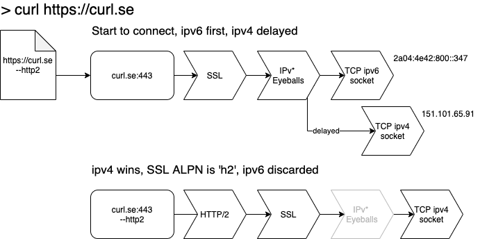
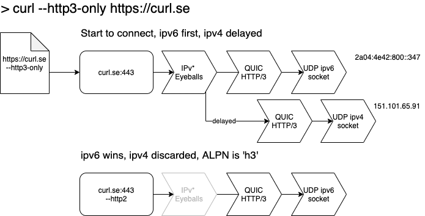
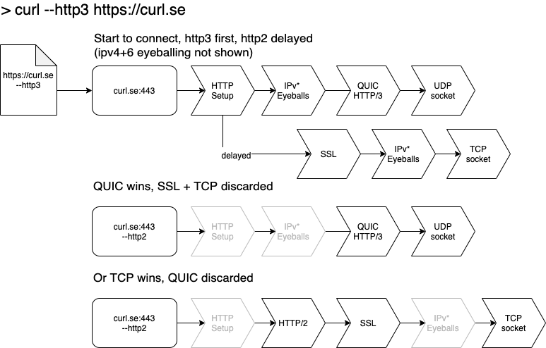

# curl (2023-01-20)

I was invited by [Daniel Stenberg](https://daniel.haxx.se) to work with him on [curl](https://curl.se) improvements sponsored by the [Sovereign Tech Fund](https://sovereigntechfund.de), an initiative of the German government to strengthen digital infrastructure and open source in the public interests. [Daniel blogged about it](https://daniel.haxx.se/blog/2022/10/19/funded-curl-improvements/).

Via this blog I try to give some updates on my ongoing work in this project, not least for transparency. This is deeply technical gobbledygook.

Today, I have create the [first PR that adds "HTTP Eyeballing"](https://github.com/curl/curl/pull/10325) to `curl`. Daniel has [a nice blog post about the matter](https://daniel.haxx.se/blog/2023/01/12/selecting-http-version-three/). In this blog I go a bit deeper into what is happening in the internals of curl regarding this new feature.

## HTTP Eyeballing

When you use `curl` to transfer a URL, you mostly rely on curl making the best choice for you (with a ton of options for you to override its default behaviour). But, as of today, if you give it a `https:` url, it will try to negotiate either HTTP/2 (e.g. 'h2') or HTTP/1.1 with the server, using SSL over a TCP connection.

## default (`--http2`)

If the server curl wants to talk to has both ip version 6 and 4 addresses, there is already more magic happening than you might be aware of. Curl will try one ip version first and, while this is still ongoing, try the other version in parallel and select the one that succeeds first. This is commonly called "happy eyeballing".

Below you see how this looks in curl's internals with the connection creating a chain of specific *connection filters* to do this. You see an `SSL` filter, on top of a `Eyeballs` filter on top of a `TCP socket` one. The eyeballs filter will, after a short while, create a second `TCP socket` filter for the other ip version.

In this example, the ipv4 socket connects first. The eyeballs filter then discards the other one. The SSL handshake runs and the connection is established. The eyeballs filter is then shown grey, as it is still there, but does not do anything anymore. At least, until the connection is closed and re-connected again.

This is the default behaviour now, the very same as if you specify `--http2` on the command line.

## new, `--http3-only`

With the next version of `curl`, we'll get the command line option `--http3-only`. That one, unsurprisingly, causes `curl` to *only* use the HTTP/3 protocol for the transfer and fail if that cannot be made to work.

As you can see in the image, the connection filters look a bit different than in the `--http2` case. The `Eyeballs` filter now creates `QUIC` filters, which use a `UDP socket` filter. It does the same IP version happy eyeballs as in the previous example.

Note that there is no `SSL` filter in place, as `QUIC` already takes care of securing the connection.

## changed, `--http3`

This command line option already exists in current curl and does the same as the future `--http3-only`. In that coming version, `--http3` will use "HTTP Eyeballing" to make the transfer. That means it will try HTTP/3 first and, again after a short while, attempt a HTTP/2 over TCP in parallel. 

Note that in the picture below, the IP version eyeballing is not shown. But it happens also, like in the previous examples! So curl might have 4 sockets opened for establishing connections, depending on the timings of replies.

As you can see, the connection filters allow "stacking" of things, making existing pieces work in new combinations. That is the benefit of the refactoring we did last year.

As I said, this is currently a PR and it needs to survive our CI and there is more polishing to do next week. As always.