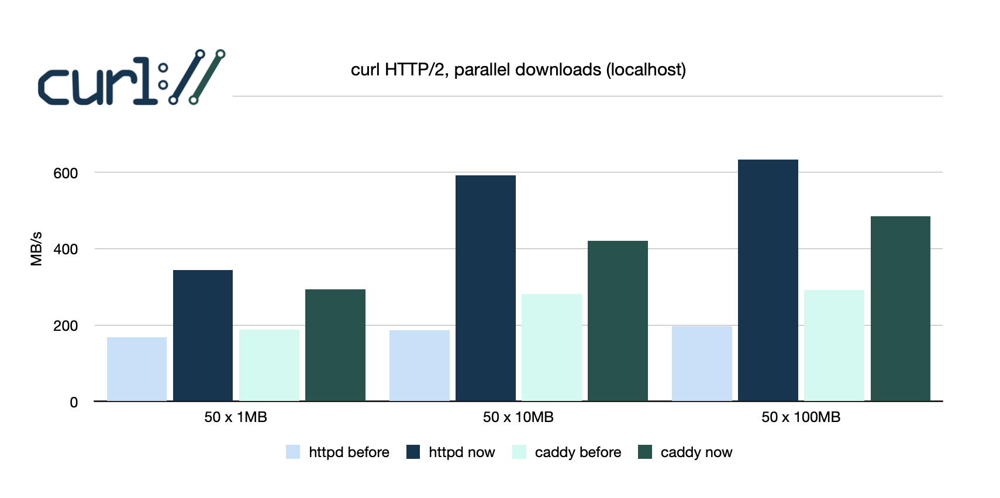

# curl (2023-01-20)

I was invited by [Daniel Stenberg](https://daniel.haxx.se) to work with him on [curl](https://curl.se) improvements sponsored by the [Sovereign Tech Fund](https://sovereigntechfund.de), an initiative of the German government to strengthen digital infrastructure and open source in the public interests. [Daniel blogged about it](https://daniel.haxx.se/blog/2022/10/19/funded-curl-improvements/).

Via this blog I try to give some updates on my ongoing work in this project, not least for transparency. This is deeply technical gobbledygook.

Today, I have create the [first PR that adds "HTTP Eyeballing"](https://github.com/curl/curl/pull/10325) to `curl`. Daniel has [a nice blog post about the matter](https://daniel.haxx.se/blog/2023/01/12/selecting-http-version-three/). In this blog I go a bit deeper into what is happening in the internals of curl regarding this new feature.

## HTTP/2 Revisited

While I am **supposed** to work on stabilizing HTTP/3, I had a short fun visit into the HTTP/2 workings of `curl`. I rationalized this by needing to understand how curl handles parallel requests and how it calls down into the protocol handlers at which times and **wtf** is going on, anyway.

To see where we are and going with out work on curl, I started a script which produces a **scorecard** for a protocol. It gives some numbers on connection/handshake/download times. To make this somewhat reproducible - and not limited by network bandwidth - it operates on `localhost`. This is not *super* relevant for most of curl usage, as often the network connection is not that fast. But some people outside my home country are rumoured to have *gigabits/s* available - even though that is hard to imagine from here. Probably an exaggeration.

So, I looked at what the `scorecard` produced on my machine and saw the bars below, the ones with the lighter colors, for HTTP/2. Now, I am quite familiar with that protocol, having implemented it in Apache httpd. And this looked weird.



The [Caddy web server](https://caddyserver.com) being faster than Apache? How can this be? I mean, what do we have the `C` memory insecurities for, if not for better performance, right? So, I traced down what was actually happening in `curl`.

`curl` always has a *current* transfer when it calls the protocol handler. It `DATA` arrives for this transfer, it is returned and, ultimately, given to the `libcurl` application callbacks or, in case of the command line tool `curl` itself, written out.

Now, as you probably know, HTTP/2 can manage many transfers on a single connection. So when `DATA` arrives on the connection for another transfer than the current one, `libcurl` stopped everything, returned and waited to be called for that other transfer again. To deliver the `DATA` that had arrived.

```
Connection:              DATA1 <- DATA2 <- DATA1 <- DATA2 <- ... 
libcurl call: transfer1---ok----> switch!
        call: transfer2--------->ok-------->switch!
        call: transfer1-------------------->ok------>switch!
...
```

This switching of transfers costs time. Now Apache, using [the excellent nghttp2](https://nghttp2.org), will be most fair on parallel downloads and alternate `DATA` frames between parallel transfers all the time. Which, in this scenario, means that `libcurl` needed to switch after every frame.

Now, if a server is a bit more relaxed about fairness, and switches only every `n` transfers, `libcurl` needs to do less work. And that is the explanation of the difference in raw download speed between Caddy and Apache.

This could not stand, of course. I changed the `curl` implementation so that it fills the buffers of `transfer1` and `transfer2` first, and *then* triggers the switching. Less administrative overhead! And that gives the numbers you see displayed in the **dark** colors.

Caddy is faster, and Apache is *much* faster. Things are as they are supposed to be! I was happy. Making the hardware *sing* is what programming is about for me. 600+ MB/s on a single TCP connection is not shabby and if you are as old as me, that is an astonishing number. It is TLS encrypted, after all.

And this is from my macOS machine. If you run this on `linux`, expect 25% or more increase in throughput.

## HTTP/3 Stabilization

Well, now that I understand the internal workings on curl better, my efforts go into improving the HTTP/3 workings. The focus here not so much on making it fast. We strive for reliable in the next release.

We have three HTTP73 backends in curl: `ngtcp2`, `quiche` and `msh3`. They all work differently and need their own adaptations to `curl`. I'd say the integration of `ngtcp2` is currently working best and a good candidate for removing the "experimental" tag. `quiche` is close behind and maybe we'll get it there. `msh3` is more in the early stages, unlikely to get there in the next release.

The base difficulty in making these work as we want to is `QUIC` and its use of `UDP`. My personal impression is that `UDP` support in the operating systems was made *just* good enough to support DNS queries, but is not well prepared for high throughput traffic patterns that QUIC desires. As someone coming from `HTTP` and `TCP`, it is a new thing to worry about "packet sizes" and "segmentation" and taking care of timers for which a millisecond is close to eternity.

So, we'll see. We beefed up our test suites to also use "real" servers like Apache and Caddy and `nghttpx`. We want to see close to real traffic that our users will experience. And take care of some edge cases. For example, the following.

### A real edge case

Servers do not live forever. Even if a domain like `curl.se` is always reachable, the machines and processes that serve your requests get restarted, stopped, update their configuration. They have a lifetime. Often measured in hours more than days.

In HTTP/2 and HTTP/3 servers can tell clients that they will soon disappear via `GOAWAY` messages. The client is then supposed to open a new connection after receiving that. Easily done.

In HTTP/2 (or more precise TCP), a shutting down server process will just stop to `listen()`. The operating system sees that and will distribute new connection attempts to other processes that still do listen. This is a smooth way for a server to gracefully restart, for example after a configuration change (or other reasons).

In HTTP/3 (and more precise UDP), there is no `listen()`. A UDP server cannot simply tell the operating system, "I do not want to see any 'new' connection attempts". Just because the OS has no concept of a "connection attempt" in UDP. (There are things like `eBPF` and such which can made to help here, but that is a bit deep into the rabbit hole for now).

Anyway, a server in shutdown will receive a new QUIC connection attempt. But then it will tell the client "no way am I serving any traffic here!". This is what QUIC calls the "DRAIN" state of a connection.

A QUIC client, on seeing its shiny new connection going into DRAIN, is then supposed to wait a short while and try again. In the hope of meeting a server process of the next generation that is willing to do work. This is something new compared to TCP that a client has to be able to manage.

This is just to give you an example that exchanging TCP for UDP is **not** just using another parameter when opening the socket.

## Anyways

Wishing you call a nice weekend. And if you are at FOSDEM, enjoy the socializing and talks and beers. And come back healthy!


