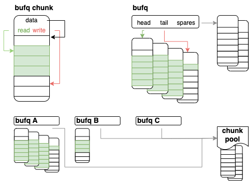

# curl (2023-03-27)

I was invited by [Daniel Stenberg](https://daniel.haxx.se) to work with him on [curl](https://curl.se) improvements sponsored by the [Sovereign Tech Fund](https://sovereigntechfund.de), an initiative of the German government to strengthen digital infrastructure and open source in the public interests. [Daniel blogged about it](https://daniel.haxx.se/blog/2022/10/19/funded-curl-improvements/).

Via this blog I try to give some updates on my ongoing work in this project, not least for transparency. This is deeply technical gobbledygook.

What has happened from my perspective in the last, almost two months? 

* **HTTP/3 Eyeballing**: this feature was released in curl 7.88.1 on February 20th.
* **curl 8**: on the 25th birthday, Daniel released curl 8.0.0 *and* curl 8.0.1. His blog has a nice post-mortem about why that was necessary. 
* **Many PRs**: since I did not want to be the one to blow up the birthday party, I worked on several pull requests with new shiny things to be merged in the coming weeks. Right now, there are 7 open.

## Regressions and Testing

We expanded the `pytest` test suite to cover more cases that we are unable to handle in the regular tests. Also, we brought this test suite into more github CI workflows, so we get verification on every change with more combinations.

The internal refactoring of curl that I did in this project bears fruit. Positive and negative ones. While curl can now do more than before and, at least in my view, in a nicer, better maintainable way, it also introduced regressions.

Since we test everything all the time, regressions are only possible if there is no test case for it. So we add them, once it turns out that people rely/expect a certain behaviour. Daniel has a nice chart where he traced the number of test cases vs. the number of code lines. Looks good.

Of course, I feel bad when I break things. But it seems unavoidable for someone who is not 25 years with the project. The up side is that every added test case makes it easier for people to contribute. Everyone can run the tests locally. So, if you want to make a contribution to curl, this will help you feel more confident about your change.

## Pending PRs

There are 4 major, pending Pull Request by me now:

* [#10720](https://github.com/curl/curl/pull/10720): Bufq+dynhds
* [#10771](https://github.com/curl/curl/pull/10771): HTTP/2 improvements
* [#10772](https://github.com/curl/curl/pull/10772): HTTP/3 improvements
* [#10780](https://github.com/curl/curl/pull/10780): HTTP/2 proxy tunneling

### HTTP/2 proxy tunneling

This is a new feature for curl that allows you to talk HTTP/2 to a *forward* proxy for tunneling. What you specify with `--proxy-tunnel` one the `curl` command line. We have not decided yet how we wire that feature into the library and the curl tool itself (`--proxy-http2` maybe?).

Ideally, using HTTP/2 here, curl could use the same proxy connection for many tunnels. But, we are not quite there yet. There are some internal mechanisms how connections are reused and those do not align yet. Connection reuse is a security sensitive topic, cause for several CVEs in the past (due to mismatch of credentials for example), so this code area is a bit touchy.

### HTTP/2 improvements

Remember that data corruption issue we had last year? This was related to the handling of buffers when downloading data. And I have now basically rewritten that for the `nghttp2` based implementation. Also, our new `pytest` test cases with parallel, heavy up- and downloads helped to debug our code in this area. Nothing like concurrency to mess up the human brain.

Yes, and as a side effect, it has also become >15% faster. I could not resist.

### HTTP/3 improvements

What I learned in making HTTP/2 more solid, is now also applied in the HTTP/3 implementations based on `ngtcp2`, `quiche` and `msh3`. Every backend has its specific API, but the overall code structure is now highly similar. Which is nice.

In the `quiche` implementation we could make some nice progress as of today. `quiche` implemented a mandatory feature in its TLS layer over the weekend. We, *cough*, reported that we would discourage quiche builds unless this changed. And it did. Nice.

With that roadblock out of the way, we could run all our test cases and discover the last flaws on our side. Now all our test cases pass with the `master` version of quiche. Once they release, we will adjust curl's configure to detect if you have a solid `quiche` version installed and refuse otherwise.

### Bufq+dynhds

Well, if you read this far, you truly are a nerd and I salute your perseverance. This last PR is, as a plot twist, the base of all the other ones above. It brings in two new data structure which I designed based on common use patterns we have in curl. 

`dynhds` is for keeping a list of dynamically changeable HTTP headers. This is not that exciting. I mainly needed it for the HTTP/2 proxy tunneling. `bufq` is used in all HTTP/2+3 implementations now. It is a queue (or list if you want) of data "chunks" where one can write to and read from. Nothing magical. Lots of network applications have those things. 

`curl` has something called `dynbuf`, which is a dynamically growing buffer, holding a single byte array and has a maximum size it may grow to. It originated from the HTTP/1 implementation where you have to serialize the request headers into a character stream before sending it off. It lacks any read support, the growing might involved reallocs and if your write too much, dynbuf intentionally self-destructs (your request headers are large than 1MB? Something must be wrong).

`bufq` keeps a list of fixed sized chunks (e.g. byte arrays) and it grows by adding another chunk. No need to move anything. And when you read the fist chunk empty, it gets on a spare list. No moving needed either. Trying to write to a full `bufq` will return the same error as if you write to a non-blocking socket. 

All this inspired by our usage inside the HTTP implementations. Which have become simpler and safer. Test cases for `bufq` itself have been added, so we are confident they do the right thing even in edge cases.

Since now every HTTP/2+3 transfer (e.g. "stream") has its own receive `bufq`, I added a "chunk pool" for sharing between all buffers on a connection. The pool keeps a maximum number of spare chunks, shared between all buffers. This means a empty buffers consume no memory, as they give all their empty chunks back into the pool. And often, a chunk can be reused right away by another stream. Memory areas can stay "hot". CPUs like that.

## Merging and Visibility

In the coming weeks, it's time to merge (e.g. integrate) all this together for the next release. And decide how to bring the new feature into the API/command line.

Also, there are some more test cases to be written against the HTTP/3 implementation. Edge cases are still lacking a bit of coverage, I believe.

