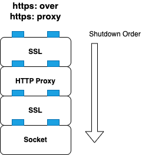

# All's well that ends well - curl edition

In the upcoming [curl](https://curl.se) 8.9.0 release, we gave some love to ending connections in a better way. What does that mean? Will it affect you? Let's start with the End.

### The End of a Connection

For most transfers curl establishes a TCP connection to a server (I disregard UDP in this blog). At some time, the connection will need to be closed again. There are several ways this is triggered:

- the server closes
- there was a network error while sending/receiving
- the transfer was aborted by the application
- the connection was kept open for reuse, but it never happened and it is now "too old"
- the maximum number of connections kept for reuse is being exceeded
- the `libcurl` application wants to terminate

So, we just close the socket? Well, *sometimes* that is the right thing to do. 

When an error occurs, when the transfer cannot be completed, we we just close. However, when everything went well, we want to *gracefully shut down*. What is the difference?

#### Shutting down TCP

Let's say the connection does not involve TLS, proxying or other fancy stuff. Just basic TCP like your grandparents used to do it. To shut down such a connection gracefully, it is a good idea to make some last *receive* on the socket. This will consume any packets that might exist in the TCP stack. When we close afterwards, there is a good chance that a **FIN** is being sent to the server. Would we close the socket without receiving, any unprocessed packets will cause a **RST** to be sent instead.

A **FIN** is a friendly "Goodbye!" at the end of the TCP conversation while a **RST** is like walking away while the other person is still talking. Rude! 

Now, we are talking about computers here, so why does being rude matter, really? To answer that precisely for TCP, you can dig really deep into protocol RFCs and blogs. Learn about states and sequence numbers and the problem of NATs and firewalls, read papers from the 90s etc, attack mitigation, etc...fun without end!

But let's cut it short: if you can **FIN**, then **FIN**.

#### Shutting down TLS

Commonly nowadays, the connection might involve TLS. So, how do we shut that down? TLS has something equivalent to **FIN**. It's called **CLOSE-NOTIFY**. It sends a special packet to the other side which translates to "I have sent you all I want to send!". TLS expects then to receive a **CLOSE-NOTIFY** back. After these have been exchanged, the TLS part of the connection is safely closed.

Why does TLS end connections this way? To prevent anyone from disrupting your communication without you noticing. This is highly relevant for **FTPS** transfers, for example. When you upload a file to an FTPS server like `vsftpd`, it *requires* the close notify. Without it, the upload is rejected. Also in HTTP/1.0 this can be useful. Modern `https:` versions have other means to assure a transfer is complete, however.

So, when curl *aborts* a transfer, it MUST NOT do a TLS shutdown. Or the other side may think it was completed successfully.

#### Other Protocols

There is HTTP/2, which wants to send a `GOAWAY` frame to announce it being done. A client should send that, but all servers are prepared to never see it (a `GOAWAY` from the server is more useful, though). FTP wants to send a `QUIT` on its control connection. 

But nothing as vital as the TLS/TCP shutdowns, AFAICT.

### Operating a Shutdown

The order in which a curl connection needs to shut down is defined by its connection filters. In the image below, you see the filter stack involved in a `https:` connection through a https proxy. The topmost filter is shut down first, terminating the TLS connection through the proxy to the server. After that, the proxy filter can be shut down, then the TLS filter to the proxy and finally the socket.

During the shutdown, data will be sent and received through the filters "below". Since curl filters operate non-blocking, an attempt to send or receive may have to be delayed. curl will then monitor the socket accordingly, e.g. "poll" it. 

By default, a timeout of 2 seconds is in place for all filters of a connection to shutdown. This will happen "behind the curtain" when your application uses `curl_multi_perform()` or `curl_multi_socket()`. And it will not stop other transfers from progressing.

#### Limitations

If you use `curl_easy_perform()` however, shutdowns will be a one-time, best-effort attempt. If shutdown data cannot be send or received right away, the connection closes. We did this to stay backward compatible to previous behaviour.

The same best-effort thing happens when you do a `curl_multi_cleanup()`. Also due to compatibility reasons. We may introduce a `curl_multi_shutdown()` in the future to make this graceful. Your input on this is appreciated.

#### Changes in Behaviour

When a connection is aborted, e.g. a transfer failed, curl will no longer do TLS shutdowns. In earlier versions, curl always tried to send a **CLOSE-NOTIFY** on closing a connection. This is no longer the case. And it is the right change to avoid broken transfers to be considered successful.

### Conclusions

Curl connection shutdowns will come in curl 8.9.0. You'll get their full benefit if you operate a multi handle. They will work gracefully in FTP up- and downloads, fixing behaviour in FTPS transfers.

Otherwise, they stay - if we did not screw things up - invisible for you. We might introduce options and functions in the API to make them more controllable by the application. This depends on your input. Do you have needs that we should accommodate?