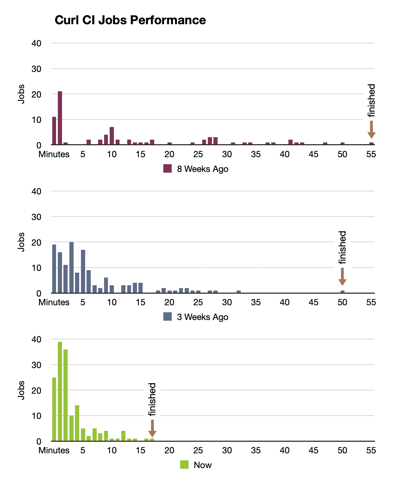

# curl CI performance and reliability

Over the last months, [Viktor Szakats](https://github.com/vszakats) and me worked on improving curl's CI system. Viktor focused on improvements in the various builds and how we cover all the platforms that we test on. I looked into improving the test suite reliability and performance.

As I like to say, our CI is the weapon we slay the dragons with that lurk in code. It needs to be sharp and precise. Even for a [little hobby project like curl](https://daniel.haxx.se/blog/2024/04/22/curl-is-just-the-hobby/).

### A Plethora of Things

Every Pull Request in curl runs now ~170 CI jobs. This has increased from ~130 jobs 2 months ago. We cover more combinations of platforms, compilers, configured libraries (TLS backends), valgrind, etc. Most of these jobs not only build curl, but run its main test suite as well. Several also run the `pytest` suite which is not supported on all platforms.

The graph below shows the main story of what we achieved so far. The overall time to wait for verification of a PR is way lower. In addition, over 100 of the build variations are done after 5 minutes. This allows any developer to detect things they have missed much, much earlier for faster turn-around times.

With the improved reliability, we want to give fist-time committers a better experience. They should not stumble into known CI problems. If their PR is good, it should be green!

Read this graph as *number of CI jobs taking this many minutes*. 8 weeks ago, there was one job that took 55 minutes and 11 that took only 1 minute or less. Now we have 25 taking 1 minute and 39 taking 2 minutes, etc. The "finished" marker is the longest running job. This is mostly the overall time of the CI, however some jobs like the curl fuzzer have dependencies, so it can vary a bit.

What did we do?

#### Moving Away from Azure

The longest running jobs were the ones we ran on Azure. Viktor was able to move those builds onto Github Workflows and we switched the  Azure jobs off. That cut our overall CI runtime almost to half. Then he added build optimizations, like unity builds, to shave of additional time.

#### Parallelism

[Dan Frandrich](https://github.com/dfandrich) implemented parallel runs of curl's test suite over the last year. This allows anyone to specify in how many "runners" the tests should split up. This worked great for us developers, reducing local test times by a factor of 10. But it proved unreliable in CI workflows, so we did not enable it there.

During the last weeks I looked at this and was able to fix many of the various things that went "sproink!" in parallel CI tests. Most were in the test code, a few were in curl itself (e.g. bugs). Some still remain a mystery (on Windows), but failures happen much less often.

## Summary

We are very happy with what we achieved. It was not an easy journey. Everyone who has ever worked with github workflows has had the experience of the ancient punch card programmer. Waiting for the results to come back after what feels like hours. Only to see that it did not work, again!

But a good test suite, a fast test suite, is vital for our work on maintaining and improving curl. There is no substitute. We think we are on track. 