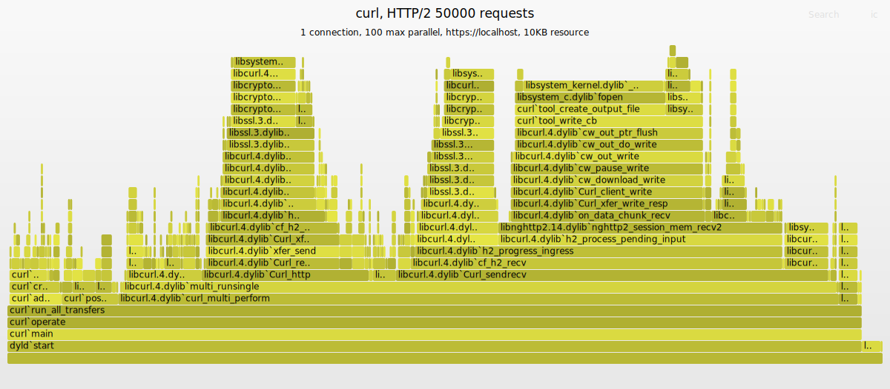
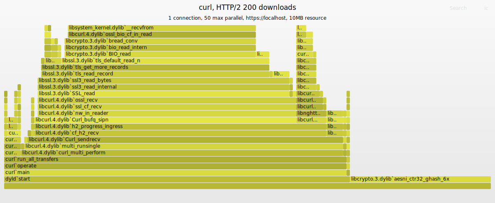

# curl Flame Graphs

Let's have some fun with flame graphs and curl!

I used curl's scorecard python script to add some `dtrace` of the curl process and [the nice FlameGraph](https://github.com/brendangregg/FlameGraph) by Brendan Gregg to have a look what curl is actually doing.

`dtrace` makes snapshots of the current stack frames here about 100 times per second and the Flame Graphs tools aggregate these and render an interactive SVG to look at the data. You can read these as follows:

* The overall width is the complete runtime of the curl process. But things are not really shown in the order they happen. While the left side *in general* started earlier than the more right entries, the are *aggregated*. When the same stack happens again later, they are accumulated in the first appearance.
* The width of a stack reflects the times this stack was seen. So, a frame of 20% width was observed in the process 20% of the overall runtime.
* The height reflects how deep the stack frames were nested.
* The colors are just for visual separation and have no further meaning. Lighter/Darker does **not** mean more CPU was used.

**Hint:** The interactive nature of the SVG is not really working when hosted on github. You should download the SVG and open it locally from file in your browser to use the interactive features - unfortunately.

So, how does it look and what is there to see?

### Requests

Here, curl made 50000 requests to a localhost Apache, using HTTP/2 to retrieve a ~10KB resource. On my macOS dev machine.

The left columns are all the work in setting up the transfers, parsing the urls, yadda, yadda. And the ones next are processing of finished transfers - reporting the results. Those are about an 8th of the total time. The next 8th is about "connecting" the transfer, meaning finding an existing connection or reusing an existing one. And everything around it.

There there is a larger peak mainly busy with sending the HTTP/2 requests. This is followed in the middle by about an 8th that receives the answers from the server, followed by a large block that writes the response out to file. Which, interestingly, is dominated by `fopen()` (I use `/dev/null` as destination - what is macOS doing here?).

On the right are two chunks with  processing of the HTTP response headers, half curl, half `nghttp2` decompressing the HPACK HTTP/2 headers. Expected.

Then last, but no least, on the rightmost, are two stacks that make checks on pending data and socket readability. The one rightmost is curl polling the sockets, which is fine. The one before that, checking for pending, looks too large. I think there is some fat to burn there.

### Downloads

This graph is from downloading a 10 MB resource 200 times, using HTTP/2 to the localhost Apache.

Here `libcrypto` from OpenSSL shows up a little weirdly. Either it is using its own thread or other optimizations that are reported by `dtrace` separately. Let's ignore that for now. Otherwise, the flame graph is dominated by receiving the 10 MB resources and OpenSSL decryption them, as it should be.

The polling and data_pending checks appear on the right as in the Requests case. Again, pending seems to large. `fopen()` plays no role as it is only called 200 times instead of the 50000 times in the previous example.

## Conclusions

Such graphs are a nice tool, easy to generate, that give a good overview where time is spent. It, of course, does not say if this is good or bad. But as the coder, you have some expectations and the graph might confirm them or surprise you. And justify a further look.

Useful.

