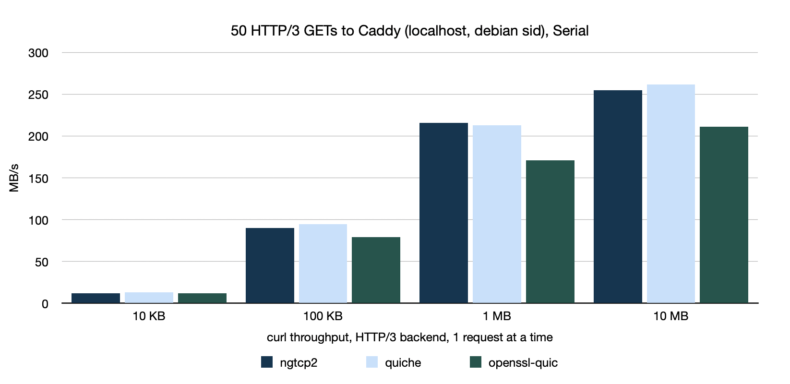
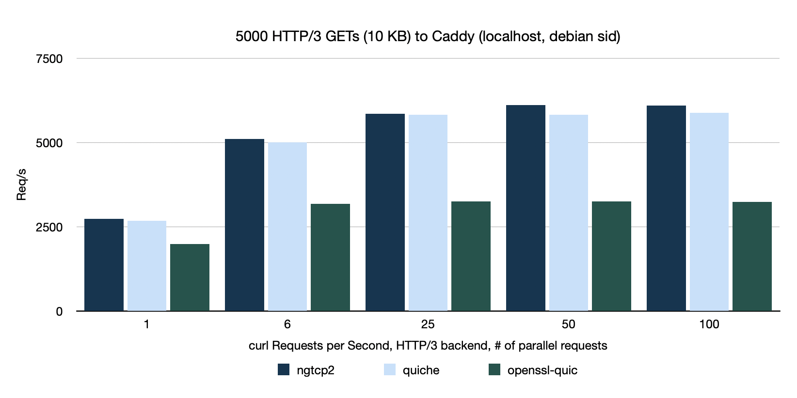
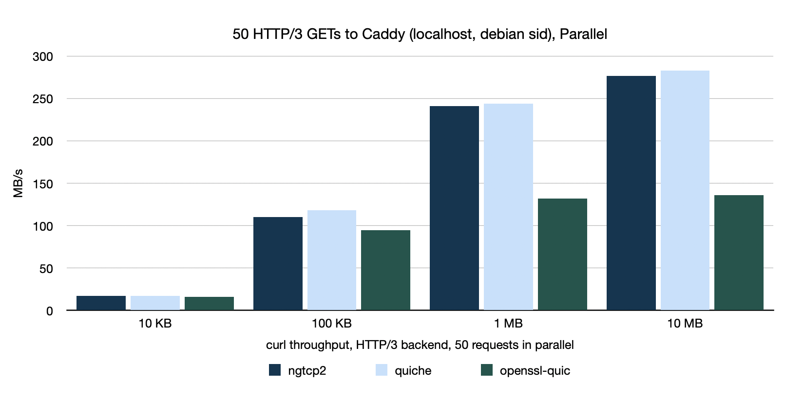
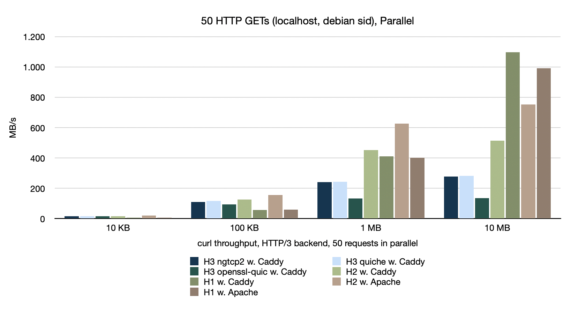

# curl HTTP/3 Performance

In the upcoming [curl](https://curl.se) 8.6.0 release, we'll ship a new, experimental HTTP/3 (QUIC) implementation using the new OpenSSL 3.2.0 QUIC stack. So, I took a look at what performance numbers I am seeing, to give you an idea what you will get. 

Of course, there are no objective benchmarks. Things may behave different in your settings. I may be holding things wrong. The measurements shown below are also just from this point in time. We continue to work on this, cooperating with projects like ngtcp2 and OpenSSL for future improvements. It might look different in the near future. Anyways, that being said...

### The Setup

I have an old PC under my desk that runs debian sid. I use that just for testing stuff. There is nothing else going on there. I updated it to the latest and greatest.

```
> uname -a
Linux tux 6.6.11-amd64 #1 SMP PREEMPT_DYNAMIC Debian 6.6.11-1 (2024-01-14) x86_64 GNU/Linux
> lscpu
Intel(R) Core(TM) i7-4770 CPU @ 3.40GHz
Thread(s) per core:  2
Core(s) per socket:  4
...
> caddy version
2.6.2
```

It has 16GB of DDR3 RAM. It's old. But with 4 real cpu cores, it can run curl tests nicely, since curl is single-threaded, leaving 3 cores available to the server.

As the server to test with I chose [Caddy](https://caddyserver.com). They say it is "THE ULTIMATE SERVER" on their website. It supports all HTTP versions, including HTTP/3. Perfect, let's go.

### curl's scorecard.py

The test results are collected using curl's `scorecard.py`, a python script I wrote that supports starting of servers and running curl against them with various, configurable parameters. I'll mention for each data set how it was invoked.

### GET a URL, 50 times, one after the other

I ran:

```
curl> python3 tests/http/scorecard.py -d h3 --download-count=50 --download=10kb,100kb,1mb,10mb
```

which does 50 downloads for each size given using `h3`, the shorthand for the HTTP/3 protocol. Testing `curl` builds with our different backends - `ngtcp2`, `quiche` and `OpenSSL's QUIC` showed the following throughput in megabytes per second:



We see roughly identical performance for `ngtcp2` and `quiche`. `OpenSSL` is a bit slower, but nothing dramatic.

### GET a URL, 50 times, vary parallelism

I ran:

```
> python3 tests/http/scorecard.py h3 -r
```

which measures Requests per Second, using GETs of a small (10 KB) resource, over and over, 5000 times. This test varies the number of requests done in parallel. `25` meaning that curl runs 25 requests over the same connection until the 5000 are done.



We again see `ngtcp2` and `quiche` head-to-head with `OpenSSL` falling behind. While more parallel transfers benefit the first two implementations, OpenSSL shows no gains after 6.

### GET a URL, 50 times, 50 parallel, different sizes

As in the first measurement, I ran:

```
curl> python3 tests/http/scorecard.py -d h3 --download-count=50 --download=10kb,100kb,1mb,10mb
```

which also does the GETs in parallel. That means curl will do 50 transfers at the same time, using the same HTTP/3 connection.



Here, we see a combination of the previous two measurements. We do only 50 transfers in total, but all parallel. `ngtcp2` and `quiche` scale up much better than `OpenSSL`.

### The Gang

To give you some perspective on the numbers, the graph below shows also the performance using HTTP/1.1 and HTTP/2. All on the same machine, of course.



You can see that HTTP/3 is not on par with the other versions when it comes to throughput. Operating systems have optimized TCP quite a lot in the past decades. This shows. Also, the HTTP/1.1 numbers are a bit unfair since they do run 50 TCP connections against the server.

### Summary

For being brand new, OpenSSL QUIC stack works well, but has some way to go to reach the maturity of the other implementations. Which is really no surprise. We are in discussions with the OpenSSL team about possible improvements and some may arrive in their April release of OpenSSL 3.3.

If you want HTTP/3 support in curl 8.6.0, we continue to recommend `ngtcp2`.