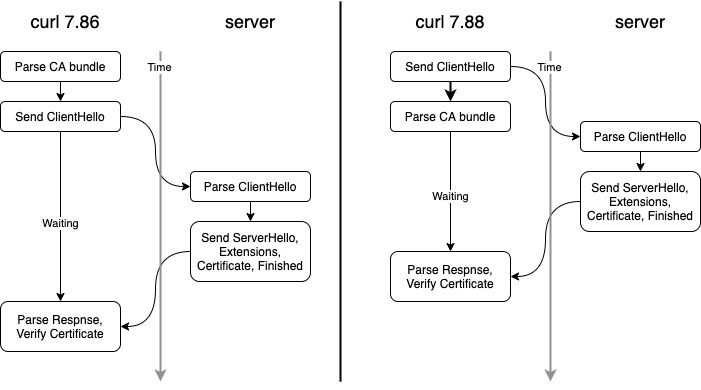

# curl handshake

I was invited by [Daniel Stenberg](https://daniel.haxx.se) to work with him on [curl](https://curl.se) improvements sponsored by the [Sovereign Tech Fund](https://sovereigntechfund.de), an initiative of the German government to strengthen digital infrastructure and open source in the public interests. [Daniel blogged about it](https://daniel.haxx.se/blog/2022/10/19/funded-curl-improvements/).

Via this blog I try to give some updates on my ongoing work in this project, not least for transparency. This is deeply technical gobbledygook.

## A Sleigh of Hand

Below, I describe an optimization in curl's internals that you may find interesting for your own 
work. Well, if you work on TLS connections from a client side. Which limits the target audience 
somewhat, agreed. Did I mention this was technical gobbledygook?

## TLS Handshake Performance (OpenSSL)

Nicolas Buch opened [#10389](https://github.com/curl/curl/issues/10389) last
week in which he noted degraded performance in `curl` 7.87 compared to 7.86. 
In particular the TTFB (Time to First Byte, e.g. when the first byte of the server response is received) had almost doubled.

We checked the numbers from our current development version and they were not quite as bad, but still worse. He reported on his tests:

```
# v7.86.0
Establish Connection: 0.020887s
TTFB: 0.089944s
Total: 0.091720s

# v7.87.1 
Establish Connection: 0.020495s
TTFB: 0.106032s
Total: 0.108102s
```

~16ms difference in TTFB. Not the world, but not nice either. So, I dug into the recent implementation. 

With the introduction of connection filters, code had become quite different from 7.86. There were more small writes to the TCP connection now, maybe buffering those could help? But buffering is a tricky thing to do right and being close to our 7.88 release, I was hesitant to tackle that.

Then I spotted that we spend quite some time in parsing the TLS trust anchors, e.g. the CA bundle, commonly placed in `/etc/ssl/cert.pem`. curl needs those to verify that the certificate presented by a server is indeed coming from on of these anchors. So, there is not way to avoid reading them.

However, there is no need for them in order to send the `ClientHello`, e.g. the first TLS message, to a server. You need them only when the reply from the server comes in. So, we moved this part of the code:



And got some nice numbers as result (from @bagder's machine to https://google.com):

```
7.81 TTFB: 0.108146s
7.86 TTFB: 0.095409s    7.88 TTFB: 0.062513s
7.87 TTFB: 0.279984s

```

This gain applies only to the first request that curl makes. Applications that make use of `libcurl` and live a bit longer will not notice that much. But users of the `curl` command line will get some speedier replies.

Hope it serves you well!