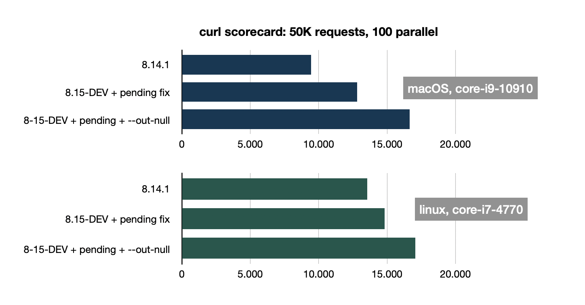

# curl platform performance

curl being used on many platforms, I looked at how my [recent improvements](curl-req-perf.md) compared on my linux (debian sid) box.

Yes, I did, but not as much. Below are the numbers for running 50000 requests of a 10KB resource on localhost, using a single HTTP/2 connection with 100 concurrent transfers. These are **requests per second**:

8.14.1 is the most recent version we shipped. The second row is the current master with the improved "data_pending" handling I [wrote about](curl-req-perf.md). The third row is the latest improvement that is currently a PR [with some bike-shedding about the option name](https://github.com/curl/curl/pull/17800).

### Not the same

Well, linux is a better OS than macOS - no one is surprised - and the 8.14.1 numbers clearly show it. You may think that the curl improvements now make them look equal, **but behold** the measurements are from **different machines**! According to "Geekbench 5 Single Core" numbers, the i7-4770 scores 908 and the i9-10910 scores 1286. This means the macOS measurements are on a **~40% faster cpu**, at least in Geekbench 5. That may not fully apply to the curl use case, but still.

Another interesting thing: the improvements done in curl are all about avoiding unnecessary system calls. The "pending fix" was removing unnecessary checks on socket readability. That seems to work much faster on linux.

### --out-null

This new command line option, the latest performance improvement, discards all response data instead of writing it out to a file. It does the same processing as before, it just does not open a file and write to it. Is this a real curl use case?

People use `-o /dev/null` quite regularly in curl. The want the transfer to happen, check that everything is fine, but are not really interested in the bytes delivered. With `--out-null` they can achieve this more efficiently. There numbers show that this saves time/effort, even on linux (and a lot on macOS).

### Will there be more?

Most likely. But harder to find. These areas for improvement were very visible in the flame graphs. The most visible now is the IO on the socket itself. As it should be in a transfer library. Maybe [io_uring](https://en.wikipedia.org/wiki/Io_uring) may be worth a look one day. Someone wants to sponsor that?

### Happy

I am quite happy with the outcome here. Always a fan of efficient coding. And it benefits everyone: every single request uses a little less power now.
