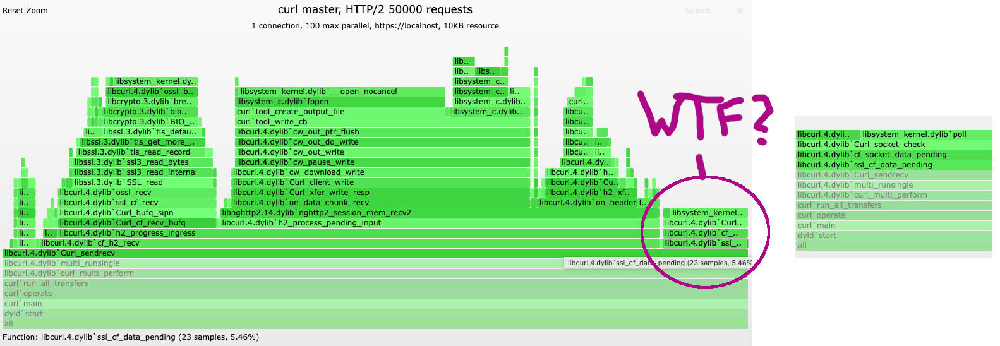

# curl request performance

Let's make curl a little bit faster!

When I looked at [curl Flame Graphs](curl-flamegraphs.md) last Friday, I noticed something that deserved my
attention. The graph below was made with curl's `scorecard.py`, a tool for running several performance related
scenarios against a curl build. I called it via

```sh
> python3 tests/http/scorecard.py -r --request-count=50000 --request-parallels=100 h2
Date: 2025-06-30T07:47:36.380050+00:00
Version: curl 8.15.0-DEV (x86_64-apple-darwin24.5.0) libcurl/8.15.0-DEV OpenSSL/3.5.0 zlib/1.2.12 brotli/1.1.0 zstd/1.5.7 libidn2/2.3.7 libpsl/0.21.5 nghttp2/1.65.0 ngtcp2/1.12.0 nghttp3/1.10.1 librtmp/2.3 libgsasl/2.2.2
Features: alt-svc AsynchDNS brotli gsasl HSTS HTTP2 HTTP3 HTTPS-proxy HTTPSRR IDN IPv6 Largefile libz NTLM PSL SSL threadsafe TLS-SRP UnixSockets zstd
Samples Size: 1
Requests in parallel to httpd/2.4.64
  size  total   100 max [cpu/rss]
  10KB  50000  9486 r/s [89.6%/23MB]
```

This does 50k requests over a single HTTP/2 connection for a 10KB resource with 100 in parallel at a time. The result then tells it did 9486 requests per second, using 89% user CPU and 24 MB of memory. That's not bad.

### Enter DTrace/Flame Graph

Below is a picture of a `dtrace` of such a run, rendered into a flame graph. On the very right, you can see a column where curl spends 5.46% of the sample stacks in `ssl_cf_data_pending`. If you click on that in the SVG, it zooms in. All the time there is spend on `Curl_socket_check()` which checks if the socket has any data to receive.



Why are we doing that? We check for all active sockets in another location already. Checking the connection socket individually should not be necessary. 

What we want to know in these `data_pending()` calls is if there is any *buffered* data that needs to be consumed. For example the TLS stack might have records read to decrypt which the layers above have not read yet. If that is the case, we need to run the transfer again right away and not wait for a socket event. In fact, the socket event might never come when the buffered data was already the last from the server. Without `data_pending()` curl would stall then.

So I removed the socket check code there...and test cases started to fail. Aha! Praise the tests!

Turns out there was one place in our HTTP/1 proxy code that used `data_pending()` to check if there was data on the socket. Once I fixed that historic misuse, all tests succeeded.

### Did it help?

I made [PR #17785](https://github.com/curl/curl/pull/17785) with this improvement. Running our scorecard from above with this PR, I can see the following on my macOS dev machine:

```sh
> python3 tests/http/scorecard.py -r --request-count=50000 --request-parallels=100 --samples=10 h2
Requests in parallel to httpd/2.4.64
...
        size  total    100 max [cpu/rss]
master  10KB  50000  9472 r/s [89.6%/24MB]
PR      10KB  50000  12299 r/s [99.4%/38MB]
```

That's almost **30%** faster than before.

Is it realistic? Well...let's say it like this: when everything else in the world is super helpful, the network and the server are fast, the sun shines, it is not too hot...then yes, you might benefit to the full extend.

Realistically though, most often other factors limit your curl performance. But on the upside, even if curl has to wait on others, it does this now using less system calls/cpu/power than before.

### Summary

This was an easy performance improvement...**once I had the flame graph to look at!** Without the graph, I might never have realised the impact of this little, unnecessary code piece. So, Yay for flame graphs!

Hope this might help you improve the piece of code you are working on and care about.