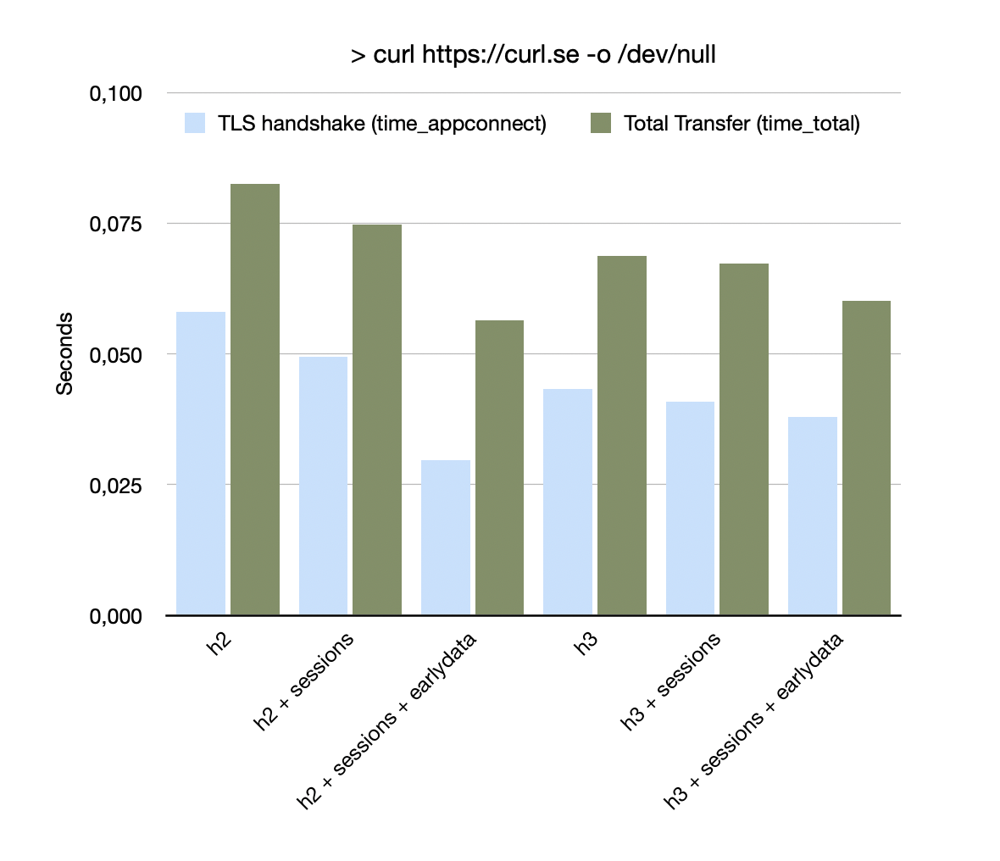

# curl SSL sessions and early data

In  the upcoming `curl` version 8.12.0 we'll add the *experimental* feature of SSL session import/export. 

You can specify a file where sessions are imported from at the start of `curl` and to which they are exported again once `curl` is done. Like in:

```
> curl --ssl-sessions my-session-file https://curl.se
```

This will work for all TLS backends that support SSL sessions in a format suitable to storage: GnuTLS, OpenSSL (and variants), wolfSSL, bearssl, mbedTLS.

Now, what is this good for? I'll explain some TLS details below, but who wants to read walls of text if they can look at an image?


### Benchmark (ymmv)

I cannot predict how this will work on your system. I did measurements on mine and the graph shows what I am seeing. I did 100 runs of 

```
> curl -s https://curl.se -o /dev/null -w '%{time_appconnect} %{time_total}\n'
```
Then I added `--ssl-session file` and did 100 runs. Finally, I added `--tls-earlydata` (my curl is built with GnuTLS where curl has early data support). And then I did all of it again with `--http3-only`.



The `time_total` is the overall time from when `curl` starts connecting to when it has downloaded the ~10KB of the page. The transfer gets somewhat faster when importing sessions and noticeably faster when early data is in play. What is going on?

### SSL Sessions Effect

You can think of an SSL session as a token a server sends to a client: "Use this to contact me again and I know it is you and you know it is me!". TLS speak is that this "resumes" the previous session.

When resuming a session on a new TLS connection, the handshake is kept smaller. Specifically the server will not send its certificates (and the chain certificates) again. The client had already seen those.

This explains the effect you see in the benchmark. When sessions are imported and a TLS resumption can be done, the handshake is a few milliseconds faster. Then the `GET` request can start earlier and the whole transfer is quicker.

In addition to this, the server may announce support for "Early Data" in an SSL session (TLSv1.3 is needed for that). And this means...

### Early Data Effect

TLSv1.3 sessions (or more precisely named "session tickets") can announce "Early Data" support by the server. Normally in SSL, a client can only send application data (like a HTTP request) *after* the handshake is done. 

With TLSv1.3, the client may - when resuming a session - already send data *before* it has seen any reply from the server. This saves a round trip. The server can start processing the HTTP request right away.

And this is why the benchmark shows a significant improvement with early data. Because I have some latency to curl.se from my home. And this explains also why *you* may see different numbers.

(Note that early data is only implemented for GnuTLS for now. We'll add support for that in other TLS backends in the future.)

### Security Aspects

Now, why doesn't `curl` do this automatically all the time? Well, there are some security aspects to consider. The session file contains data that you might not want to have stored automatically on a machine where you use curl.

`curl` uses salted hashes instead of hostnames in the file. This prevents anyone who can read the file to easily see what hosts you have been talking to. This works similar to `ssh`'s 'known_hosts' file, if you are familiar with that. 

But the salted hash does not prevent someone from checking if you have connected to `www.furries.net` in the recent past. Or try a brute-force attack on guessed names.

Early Data has other security implications. It is not as secure as other TLS traffic. It's a trade off. And it depends what kind of requests you do with it. There are many articles about it by people more knowledgeable than me, if you are interested.

### Experimental

We made this feature *experimental* in curl, because we need feedback from our users if the current implementation is good enough. Let us know!
