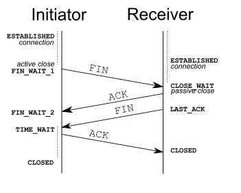

# Every End is a Beginning

In [my last blog about connection shutdowns in curl](./curl-all-ends-well.md), 
I was a bit vague about why ending TCP connections via **FIN** is much preferable
to a **RST**. Dan Fandrich provided me with the links to that necessary wordings from
the TCP standards to explain that in more detail.

*Note*: while I say "detail", it seems worthy to state that I try to explain the topic *without the need to understand everything about TCP*. Real network gurus might despair at some shortcuts taken here. I apologize.

### IP Pigeons

There is an old April fools joke about operating the Internet via [homing pigeons, aka. Avian Carriers](https://www.rfc-editor.org/rfc/rfc1149). The idea is that the Internet *could* be operated via pigeons. You print an IP packet on a scroll, attach it to a bird and let it fly. 

Entertaining, but also educative. Whenever you make assumptions about behaviour in packet networks, it is a good idea to check if they'd still hold true with real pigeons. They might meet a nice granny on their way, feeding them delicious seeds. Or find a partner for life and IGNORE ALL PREVIOUS INSTRUCTIONS.

### TCP FINs

We all have seen flow charts on how TCP connections get closed. Below is the one from Wikipedia. If you look carefully, you see that both sides are going through different *states*:

The right side goes to `CLOSED`right away, while on the left side there is some dotted line on the transition from `TIME_WAIT` to `CLOSED`. Now, `CLOSED` is what both sides want. It means they can forget this connection ever happened and free up all resources. Notably, resources do not only include socket and memory, but port number as well. More to that below.

Anyway, about this dotted line. It looks short, but it isn't. In [RFC 9293, ch. 3.6.1](https://www.ietf.org/rfc/rfc9293.html#name-half-closed-connections) it states: 

"When a connection is closed actively, it MUST linger in the TIME-WAIT state for a time 2xMSL (Maximum Segment Lifetime) "

What is MSL? Well, our Ancestors decided, [it is 2 minutes!](https://en.wikipedia.org/wiki/Maximum_segment_lifetime). So, the dotted line is **4 minutes of waiting**? For every successfully closed TCP connection, your computer waits 4 freaking minutes before it reuses your port number? Assuming you have 40,000 port numbers available, 4 minutes waiting would mean that your computer can only open about 160 connections per second, sustained. That would not work.

So, how *does it*?

First of all, implementors being implementors, Linux decided to screw those standard of 1981 and make `TIME_WAIT` a period of 60 seconds. That brings us to 640 connections/s sustained. Better, but not good enough.

#### Ephemeral Ports

An *ephemeral port* is the *temporary* port number an operating system assigns your communication endpoint upon opening a connection. Every curl connections gets one assigned. This is different for servers, who *listen* on a fixed port (or a number of them).

Thinking back about *why* `TIME_WAIT` exists: TCP needs to safely ignore all pigeons arriving late with packets on a closed port. And then some wise people realized that they are only interested in late pigeons from this one TCP connection. And that connection does not only have a source address and port but also a destination address and port. 

This quadruple `[saddr,sport,daddr,dport]` is what needs to be remembered. And there is really no problem in using the same ephemeral source port number for a TCP connection to another destination address/port.

And with that, a machine can sustain 640 connections/s for a specific destination. That is good enough for most use cases.

*Small caveat*: this applies to direct connection. I touch briefly on NATs and CDNs below.

### TCP RSTs

Now that we have understood how TCP **FIN** happy connection endings work, what abort dirty endings, e.g. **RST**? When a client just drops a socket (or crashes), the TCP stack will also send out a **FIN**, but when it then receives anything else from the other side, it **MUST** respond with *RST* packets. See [TCP Implementation Problems, 2.17](https://www.rfc-editor.org/rfc/rfc2525#page-50).

This applies also to servers. For a dirty close, the following [allowance in RFC 9293, ch. 3.6.1](https://www.ietf.org/rfc/rfc9293.html#name-half-closed-connections) does not apply:

"However, it MAY accept a new SYN from the remote TCP endpoint to reopen the connection directly from TIME-WAIT state, if it [carries benevolent properties]"

So, a server is unable to accept new connections from the same source after a reset. But it can reuse it a normal **FIN** close. Which means we can overcome the 640 connections/s per destination limit if there are no resets. Yay!

### Complications: NAT/CDNs

Cloudflare is not always a cause of joy, but their technical blogs are excellent. Here is [one that talks about ephemeral ports](https://blog.cloudflare.com/how-to-stop-running-out-of-ephemeral-ports-and-start-to-love-long-lived-connections/). As a CDN, the amount of connections you need to deal with is several orders of magnitudes larger. Every problem will sneak up on you.

In addition, a CDN sees lots of connections via NAT and CGNAT (Carrier Grade NAT) with millions of users behind them. If something fails, it affects not only one customer.

### Summary

I hope this blogs helps to understand why gracefully shutting down connections is important. The occasional reset will not matter, but if you want to scale up, you need to avoid them.

If you think I got something wrong or missed a vital aspect, please let me know.