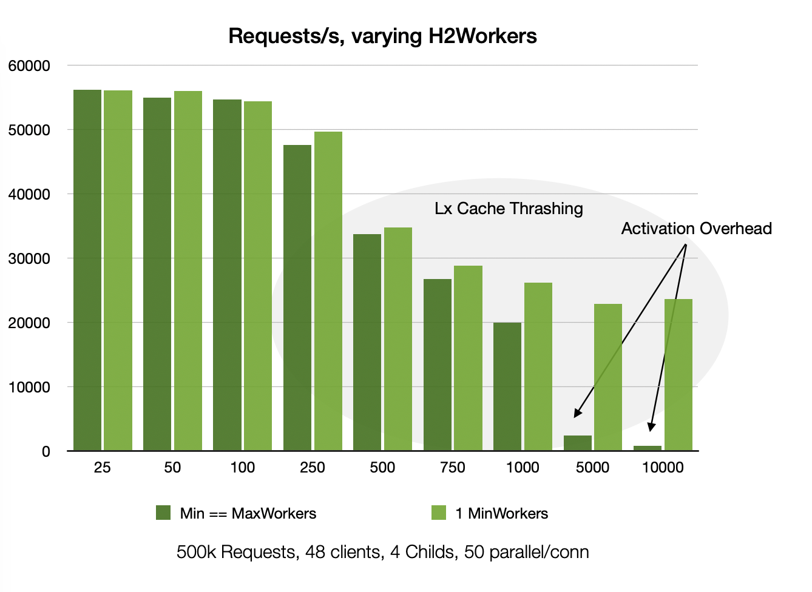

# Apache HTTP/2 Workers Extreme (SSE Version)

Recently I had a customer reporting stalls in his Apache httpd installation. Those were
happening on HTTP/2 requests. It took minutes before a response was sent to the client. 
What was going on?

The installation used Apache as a reverse proxy for an application server, a very common setup,
and the app server used [Server Sent Events](https://developer.mozilla.org/en-US/docs/Web/API/Server-sent_events) (SSE) with browser clients. SSE are `GET` request that are meant to run for a very long time (in HTTP's definition of "long"). Whenever something happens in the app server that the client should know about, it sends a small JSON piece in the response body. The request is left open until either server or client decides to drop it.

In this particular application, each browser Tab has 2 SSEs open on average. For the human users it is common to have 5 browser tabs open at the same time. Since browsers tend to share HTTP/2 connections between tabs, each HTTP/2 connection had ~10 long running requests all the time.

The default configuration of Apache httpd is not suited for this. Indeed, [Mozilla warns about SSE complications](https://developer.mozilla.org/en-US/docs/Web/API/Server-sent_events/Using_server-sent_events), but only in the case of HTTP/1.1:

```
Warning: When not used over HTTP/2, SSE suffers from a limitation to the maximum 
number of open connections, which can be especially painful when opening multiple 
tabs, as the limit is per browser and is set to a very low number (6). 
```

HTTP/2 is supposed to solve all this magically. The [IETF standard](https://www.rfc-editor.org/rfc/rfc9113.html) says 
you can have 100 parallel requests on a connection, after all! So, why is Apache not just doing this? Well, there is actually some thought behind this.

HTTP requests are, historically, designed to be rather short-lived. Connections may live quite long, serving bursts of requests with idle time in between. Inactive connections are monitored but do not use any resources otherwise. Active connections however need CPU power, so they get a *Worker* assigned. To serve more connections, you need more workers.

This is the same for HTTP/2 processing in Apache. To serve requests from a h2 connection they use *H2Workers*, a separate resource from the connection workers. By default, Apache will start as many H2Workers as there are connection Workers configured. If N connection workers for HTTP/1.1 requests are sufficient, then N H2Workers can do the job as well.

This assumes that your Apache needs to serve the same requests via HTTP/2 as it does via HTTP/1.1. This assumption is broken by SSEs. Their design says *"Behold, we are no longer restricted by the chains of ancient HTTP/1.1! Let's go wild!"*

Well, yes. But you have to tell your Apache about it.

Because there can be too many workers, as shown in the following graph:


This measures performance in requests/second for 500k HTTP/2 requests over 48 connections, varying the amount of H2Workers configured in the server. Each connection sends 50 requests in parallel.

Notably, in this use case, the performance starts to drop with more than 100 H2Workers. In those use case, there are always ~2400 requests in the server ready to be processed. As you see, it is twice as fast to process these with 100 workers than with 1000! (I'll say more to the difference between the dark and light green bars below)

Why does the performance drop? With 1000 threads, rapidly switching between each other, the CPU caches become less efficient. The current thread needs memory that has been purged from the cache by previous threads and needs to be retrieved again. And again. The CPU stalls.

### Min Max

Apache has separate configurations for `H2MinWorkers` and `H2MaxWorkers`. H2Minworkers threads are created at the start of the server and will always be around, waiting for work. If requests arrive and no worker is free, more threads are created up to H2MaxWorkers. When these additional workers have nothing to do for a while (determined by `H2MaxWorkerIdleSeconds`, they will disappear again.

The difference between the dark and light green bars is the amount of `H2MinWorkers`. Having too many workers around creates overhead by itself. Quite severely as shown in the 10000 workers case. Partly of this is due to CPU cache thrashing also, partly this is the implementation not optimized for this.

In short: keep your `H2MinWorkers` count low.

### Back to SSEs

Coming back to the application with many SSE requests. Since there are 10 SSE requests ongoing per connection, you need that many additional H2Workers available to serve them. 

Fortunately, this will not have the negative performance impact as for the use case shown in the graph. SSE requests are mostly idle, needing no CPU attention, thus do not cause cache thrashing or activation overhead. You can grow `H2MaxWorkers` without great drops in performance. However, your server will become more exposed to clients that perform many parallel non-SSE requests. It then depends on your overall application security handling how you want to mitigate that.

## Conclusions

If you have influence on the application design, be aware that SSEs (or any other long-running requests, say WebSockets) do not come for free. The parallel promises that seem be baked in HTTP/2 may not hold for everything you can dream up.

An investment in using SSEs smartly will pay off when trying to scale. Use a single SSE to multiplex your events and share SSE requests between browser tabs if your app relies on that. If clients have a 10-fold increase in server resource allocations (long term!), consider alternatives.

Even if you deploy another reverse proxy than Apache, one that may be smarter about such use cases, your SEE requests will need to be served in your app server. Are you certain it can do the 100000 SSEs needed for 10000 users? How many users do you plan to have in the future?