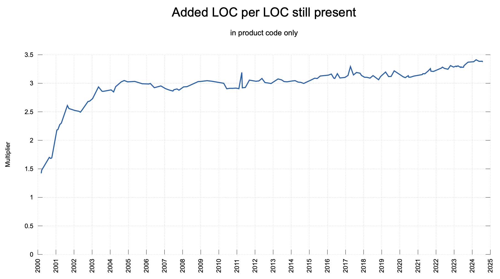

# Proof of Pi

[Daniel](https://mastodon.social/@bagder) just posted 
[a new graph](https://curl.se/dashboard1.html#added-per-line) on hist 
famous collection of curl statistics and I like to blab a bit about it.

### The `curl` Graph

It is called "Added LOC per LOC still present" because we like flashy
marketing speech in the curl project. What is shows is basically 
"How often do we change code lines over time". Examples:

* if we wrote perfect code and outside requirements would never change, we'd
never have to revisit it. The graph would be flat at multiplier **1**.
* The code that stays in curl, as the graph shows, has been changed on
average **twice** after it was added.

Or as I like to sum it up: 

```quote
We write Pi lines of code for each line in curl.
```
Does this remind you of something?




### The Occult Art of Effort Estimation

Many innocents have been sacrificed at the altar of Software Estimates. 
[The Mythical Man Month](https://en.wikipedia.org/wiki/The_Mythical_Man-Month), 
now soon 50 years old, still is unchallenged in its truths and wisdom. But while
it has much to offer to project management, e.g [Brook's law](https://en.wikipedia.org/wiki/Brooks%27s_law):

```
What one programmer can do in one month, two programmers can do in two months.
```

what is the reality of the single programmer?

The unavoidable dread in the life of a programming individual is that you will be
asked the question "How long will it take?". The Unknown, partially defined feature
that you will have to work on?

The rule of thumb that I and many others learned over the years works pretty well
but is embarrassingly simple:

```
Think hard about what you need to do, make an estimate and then multiply it by Pi.
```

That's it. What you can improve on is the first part: your skill, your knowledge of
the domain, your tools. However, whatever you do, the factor Pi remains. And this is
what we can also see in the curl graph: every line of code needs Pi times the effort
to write the initial version.

### Relevance

While this may sound funny to some, the curl graph shows evidence from a project over 24 years!
With a astonishingly constant factor. There are not many projects for which such data
exists or has been published. It would be very interesting to see this for other, long-lived
projects.

### Personal Interpretation

I believe, without offering any data, that the factor Pi reflects on how we learn. We can
think about a new problem/feature as much as we like, we *learn* about our thinking only
by writing the first version. From that we see what we got right and what we missed.

We write the second version and sometimes we get it right, but most often we need to
think again and make a third one. Some problems might need even more, be it because
of their complexity or our inexperience in the domain. 

But, on average, we do it Pi times.

### The AI Angle

Will AI help us? Some people report that AI saves them a lot of time in making the 
initial version. Because they "just" need to come up with the correct prompt and AI
will spit out the matching code.

But matching what exactly? If the problem is somewhat new (or the environment has
unique requirements) you still need to do the iterations on the code. Except, it is
not *your* code and you need to learn what the AI did and what it missed (apart from
the security and license implications of just slapping the AI code into your work result).

I am sceptical.


